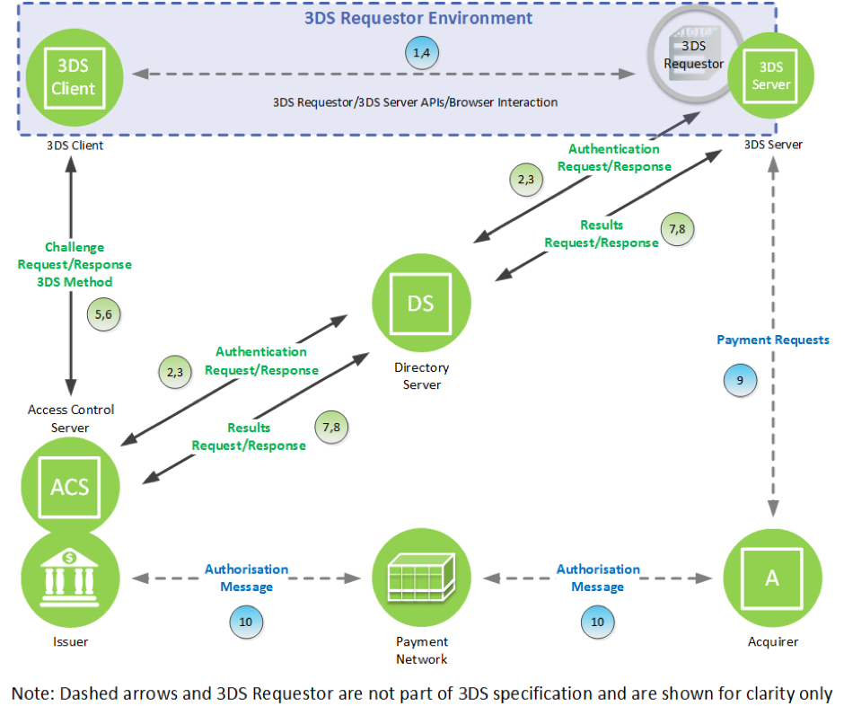
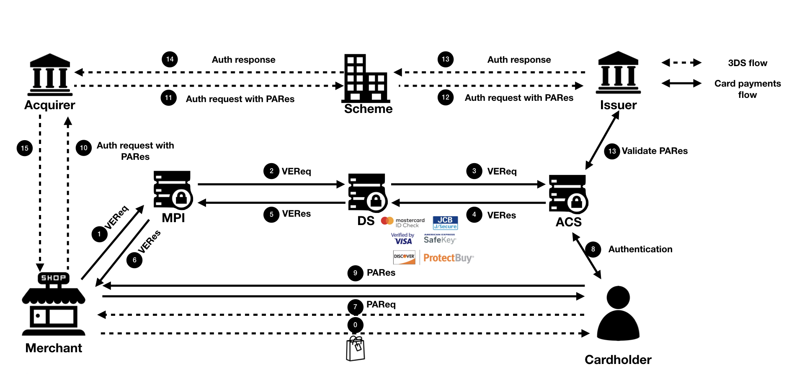

# 3-D Secure

NOTE: This is still pretty much work in progress

Basic implementation of 3-D Secure components for educational purposes:

* 3DS Server
* Directory Server
* Access Control Server

### 3DS 1.x vs 3DS 2.x

|Transaction Phase                        |3DS 1.x    |3DS 2.x              |
|-----------------------------------------|-----------|---------------------|
|Card range load                          |CRReq/CRRes|PReq/PRes            |
|Participation/enrollment check           |VEReq/VERes|AReq/ARes            |
|Frictionless authentication              |N/A        |Part of AReq/ARes    |
|Challenge authentication and confirmation|PAReq/PARes|CReq/CRes + RReq/RRes|

### Other implementations of 3-D Secure components

* https://github.com/rbkmoney/three-ds-server
* https://github.com/rbkmoney/three-ds-server-domain-lib
* https://github.com/rbkmoney/three-ds-server-compose

### 3-D Secure 2.0 Challenge Flow

### 3-D Secure 1.0 Flow

